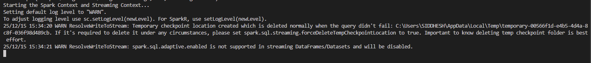
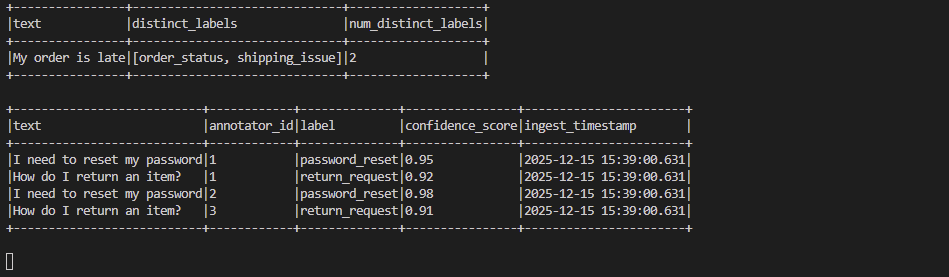
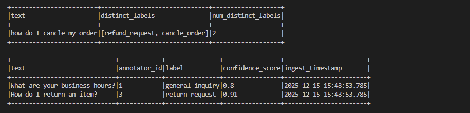
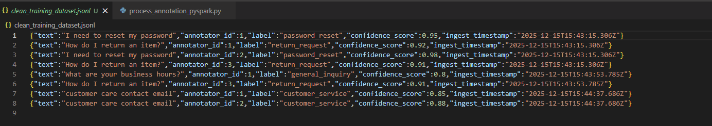
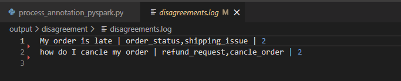

## 1. Overview

this code takes the input csv from prescribed input directory CSV folder. and runs the pyspak transformation to apply below quality validations.

1. Quality Check 1 (Confidence): Filter out any annotation with
a confidence_score less than 0.8.

2. Quality Check 2 (Agreement): For the remaining
annotations, identify any text samples where annotators disagreed on
the label (e.g., "My order is late"). Log these disagreements to a file
named disagreements.log.

this code utilizes pyspark for the processing due to its scalablility and other features like Unified Data processing and in memory computation. Spark optimizes performance through lazy evaluation. Instead of processing data immediately, Spark builds a DAG of the operations to be performed. Spark ensures reliability by offering fault tolerance through the concept of Resilient Distributed Datasets (RDDs).

## 2. Dependancy 

requirements.txt has Pyspark == 3.5.0 and this code relies on 
spark-3.5.7-bin-hadoop3 and jdk-18.0.2.1

if you are running on windows set below system environment variables.

1. HADOOP_HOME = C:\spark\spark-3.5.7-bin-hadoop3
2. JAVA_HOME = C:\Program Files\Java\jdk-18.0.2.1
3. SPARK_HOME = C:\spark\spark-3.5.7-bin-hadoop3

create a CSV folder in current directory and run following command.
in the larger picture we can have the attached code running in databricks with suitable environment with pyspark and get the input path pointed to the ADLS Gen2 container where Azure ML studio will output the CSV files with annotations. 

```python
python process_annotation_pyspark.py
```
## 3. Output

**process_annotation_pyspark.py**







**clean_training_dataset.jsonl**



**disagreements.log**


