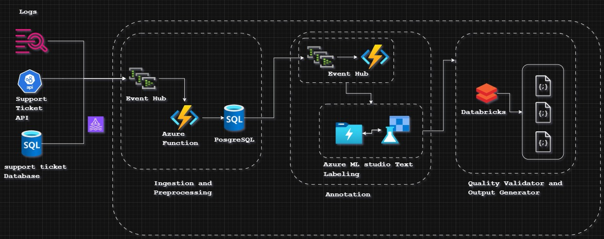

# Design Document: Annotation Architecture


## 1. Overview

The diagram illustrates a modular data annotation pipeline, divided into three main stages: Ingestion and Preprocessing, Annotation, and Quality Validation & Output Generation. It also integrates logging and support ticket management for monitoring and support.


## 1. Architectural Diagram Main Components

The annotation architecture is designed as a modular pipeline for data ingestion, annotation, validation, and output generation. The system is divided into three main layers:

- **Sources**: support ticket sources can be Ticket Generating API,Logs SQL Database.
- **Ingestion and Preprocessing**: Handles data intake and initial preprocessing of data it heavely relies on even-hub and azure functions trigger to perform preprocessing of Ticket Data.
- **Annotation**: Manages the annotation process using Azure ML studio workspace and read/store results to ADLS Gen 2data processing tools.
- **Quality Validator and Output Generator**: Validates annotated data apply filterin condition and generates final outputs.
    - filter annotations with confidence < 0.8
    - filter and seperate annotations with disagreements.

    This layer utilzes databricks structured streming.

Supporting components include logging, support ticket management, and integration with both Azure and AWS services.

## 2. Component Checklist

- **Event Hub**: Entry point for streaming data ingestion.(kafka streaming with topics)
- **PostgreSQL Database**: Stores ingested and preprocessed data.
- **Azure Function**: Orchestrates data flow and preprocessing logic linked to event hub triggers.
- **Databricks Structured Streaming**: Performs scalable data processing and transformation and qulity validation.
- **Azure ML Studio (Text Labeling)**: Provides annotation and labeling capabilities for text data.
- **Data Lake Storage Gen2**: Stores intermediate and processed data in the form of parquet or CSV.
- **Support Ticket API & Database**: ingestion sources handles issue tracking and support requests.

## 3 Component Description


- **Ingestion and Preprocessing**:

    Event Hub: Acts as the entry point for incoming data streams. It receives data from external sources, including logs and support ticket systems. it triggers Azure Functions which processes incoming data from the Event Hub, performing initial transformations or filtering as needed.
    - this process assigns UNIQUE_DOC_ID hash and 
    stores the preprocessed data for further use in the annotation stage in PosgreSQL.
    - this process maintains the PII masking and governence with inbuilt function of Posgres masking policy.

- **Annotation Layer**

    Kafka Streams app: continuously monitors DB changes (via Debezium CDC stream) and Change Data Capture (CDC) from SQL detecting records with status "preprocessed" and ready for annotation.

     Azure Function with an Event Hubs trigger that reads text events, formats them as .csv files, and uploads to the Blob container linked to your ML Studio labeling project. Enable incremental refresh on the project to automatically detect and queue new files for annotation.​

     This contains the Ticket Text , datetime , UNIQUE_DOC_ID and other extra fields if required.
     
     - **Azure Function Code Outline** :- 
     
        It uses the Azure SDKs in Python; for example, in Python: import azure.functions and azure-storage-blob, then in the trigger handler, batch events into files with unique names (e.g., date-timestamp-based) and call blob_service_client.get_blob_client().upload_blob(). Assign the ML workspace's managed identity Storage Blob Data Contributor role on the storage account.

    This serverless approach handles variable throughput scalably, monitor Function logs for errors and use Event Hubs checkpoints for at-least-once delivery;

    - **Export Labeled Data from ML Studio**
            
        After annotation in the text labeling project, export labeled data as .csv or .json via the project's Export tab to a Blob container or ADLS Gen2 path accessible by Databricks Structured Streaming.
        
- **Quality Validator & Output Generator**
    - **Databricks Streaming Job Setup**

        In a Databricks notebook, use ```python spark.readStream``` with cloudFiles (Auto Loader) to ingest new labeled files:
    
    - **Handling Date based naming convention**

        Handling Date-Based Naming Conventions Configure Auto Loader to target the parent directory containing date-partitioned subfolders 'abfss://container@account.dfs.core.windows.net/labeled/YYYY/MM/DD/', automatically discovering and ingesting new files regardless of naming:

    ```python
    # Databricks (PySpark) - Auto Loader (cloudFiles) streaming example
    from pyspark.sql.types import StructType, StructField, StringType, DoubleType, TimestampType, IntegerType
    from pyspark.sql.functions import col

    # -- Configure paths (replace with your values) --
    input_path  = "abfss://<container>@<storage-account>.dfs.core.windows.net/path/to/labeled/YYYY/MM/DD/"
    checkpoint  = "dbfs:/mnt/checkpoints/auto_loader/labeled_files/"
    out_delta_high_conf = "dbfs:/mnt/delta/labeled/high_confidence/"
    out_delta_low_conf  = "dbfs:/mnt/delta/labeled/low_confidence/"

    # -- Define schema matching exported labeled files (adjust types/fields as needed) --
    schema = StructType([
        StructField("UNIQUE_DOC_ID", StringType(), True),
        StructField("ticket_text", StringType(), True),
        StructField("label", StringType(), True),
        StructField("confidence", DoubleType(), True),
        StructField("annotator_count", IntegerType(), True),
        StructField("annotator_agreement", DoubleType(), True),
        StructField("created_at", TimestampType(), True)
    ])

    # -- Read stream with Auto Loader (cloudFiles) --
    df = (spark.readStream
        .format("cloudFiles")
        .option("cloudFiles.format", "csv")           # or "json" / "parquet"
        .option("header", "true")
        .option("maxFilesPerTrigger", 100)
        .option("cloudFiles.includeExistingFiles", "true")
        .schema(schema)
        .load(input_path))

    # -- Simple transformations / filters per quality rules --
    # Example: separate high-confidence and low-confidence annotations,
    # and detect potential disagreements (low agreement or multiple annotators disagreeing)
    high_conf = df.filter(col("confidence") >= 0.8)
    low_conf  = df.filter(col("confidence") < 0.8)

    # Optional: mark disagreements (adjust logic to your schema)
    disagreements = df.filter(col("annotator_agreement") < 0.6)

    # -- Write streams as JSONL (newline-delimited JSON) to high_conf/ and low_conf/ --
    (high_conf.writeStream
        .format("json")
        .option("path", out_delta_high_conf)                       # writes JSONL files to this location
        .option("checkpointLocation", checkpoint + "high_conf/")
        .option("compression", "none")
        .outputMode("append")
        .start())

    (low_conf.writeStream
        .format("json")
        .option("path", out_delta_low_conf)
        .option("checkpointLocation", checkpoint + "low_conf/")
        .option("compression", "none")
        .outputMode("append")
        .start())

    # -- Write disagreements as CSV --
    (disagreements.writeStream
        .format("csv")
        .option("path", "dbfs:/mnt/delta/labeled/disagreements/")
        .option("checkpointLocation", checkpoint + "disagreements/")
        .option("header", "true")
        .outputMode("append")
        .start())
    ```

## 3. Technology Description

- **Azure Event Hub**: 

    Real-time data streaming platform for high-throughput data ingestion.
    we can have data retaintion from up to to 7 days

- **Azure Function**:

    azure function for stateless preprocessing and enrichment/transformation

- **Azure Data Lake Storage Gen2 (ADLS Gen2)**

    for storing intermidiate results and keep CSV raw annotations and final JSONL output combining the performance of a file system with Blob's low-cost scale and features like lifecycle management, making it ideal for data lakes in Azure. It supports all data types (structured, semi-structured, unstructured) and integrates seamlessly with analytics    

- **Pyspark**:
    Unified Data processing and in memory computation. Spark optimizes performance through lazy evaluation. Instead of processing data immediately, Spark builds a DAG of the operations to be performed. Spark ensures reliability by offering fault tolerance through the concept of Resilient Distributed Datasets (RDDs).


    


 management.

## 4. Data Lineage

1. **Data Ingestion**: Data enters the system via Event Hub.
2. **Preprocessing**: Azure Functions process and store data in PostgreSQL.
3. **Processing**: Data is moved to Databricks for transformation and preparation.
4. **Annotation**: Azure ML Studio performs text labeling and annotation.
5. **Storage**: Annotated data is stored in Data Lake Storage.
6. **Validation**: Quality Validator checks the annotated data.
7. **Output Generation**: Final outputs are generated and made available for downstream use.
8. **Monitoring & Support**: Logs are captured in CloudWatch; issues are managed via the Support Ticket API and database.
