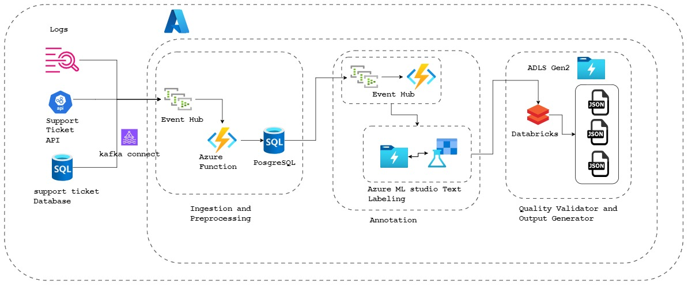

# Design Document: Annotation Architecture


## 1. Overview

The diagram illustrates a modular data annotation pipeline, divided into three main stages: Ingestion and Preprocessing, Annotation, and Quality Validation & Output Generation. It also integrates logging and support ticket management for monitoring and support.


## 1. Architectural Diagram Main Components

The annotation architecture is designed as a modular pipeline for data ingestion, annotation, validation, and output generation. The system is divided into three main layers:

- **Sources**: support ticket sources can be Ticket Generating API,Logs SQL Database.
- **Ingestion and Preprocessing**: Handles data intake and initial preprocessing of data it heavely relies on even-hub and azure functions trigger to perform preprocessing of Ticket Data.
- **Annotation**: Manages the annotation process using Azure ML studio workspace and read/store results to ADLS Gen 2data processing tools.
- **Quality Validator and Output Generator**: Validates annotated data apply filterin condition and generates final outputs.
    - filter annotations with confidence < 0.8
    - filter and seperate annotations with disagreements.

    This layer utilzes databricks structured streming.

Supporting components include logging, support ticket management, and integration with both Azure and AWS services.

## 2. Component Checklist

- **Event Hub**: Entry point for streaming data ingestion.(kafka streaming with topics)
- **PostgreSQL Database**: Stores ingested and preprocessed data.
- **Azure Function**: Orchestrates data flow and preprocessing logic linked to event hub triggers.
- **Databricks Structured Streaming**: Performs scalable data processing and transformation and qulity validation.
- **Azure ML Studio (Text Labeling)**: Provides annotation and labeling capabilities for text data.
- **Data Lake Storage Gen2**: Stores intermediate and processed data in the form of parquet or CSV.
- **Support Ticket API & Database**: ingestion sources handles issue tracking and support requests.

## 3 Component Description


- **Ingestion and Preprocessing**:

    Event Hub: Acts as the entry point for incoming data streams. It receives data from external sources, including logs and support ticket systems. it triggers Azure Functions which processes incoming data from the Event Hub, performing initial transformations or filtering as needed.
    - this process assigns UNIQUE_DOC_ID hash and 
    stores the preprocessed data for further use in the annotation stage in PosgreSQL.
    - this process maintains the PII masking and governence with inbuilt function of Posgres masking policy.

- **Annotation Layer**

    Kafka Streams app: continuously monitors DB changes (via Debezium CDC stream) and Change Data Capture (CDC) from SQL detecting records with status "preprocessed" and ready for annotation.

     Azure Function with an Event Hubs trigger that reads text events, formats them as .csv files, and uploads to the Blob container linked to your ML Studio labeling project. Enable incremental refresh on the project to automatically detect and queue new files for annotation.​

     This contains the Ticket Text , datetime , UNIQUE_DOC_ID and other extra fields if required.
     
     - **Azure Function Code Outline** :- 
     
        It uses the Azure SDKs in Python; for example, in Python: import azure.functions and azure-storage-blob, then in the trigger handler, batch events into files with unique names (e.g., date-timestamp-based) and call blob_service_client.get_blob_client().upload_blob(). Assign the ML workspace's managed identity Storage Blob Data Contributor role on the storage account.

    This serverless approach handles variable throughput scalably, monitor Function logs for errors and use Event Hubs checkpoints for at-least-once delivery;

    - **Export Labeled Data from ML Studio**
            
        After annotation in the text labeling project, export labeled data as .csv or .json via the project's Export tab to a Blob container or ADLS Gen2 path accessible by Databricks Structured Streaming.
        
- **Quality Validator & Output Generator**
    - **Databricks Streaming Job Setup**

        In a Databricks notebook, use ```python spark.readStream``` with cloudFiles (Auto Loader) to ingest new labeled files:
    
    - **Handling Date based naming convention**

        Handling Date-Based Naming Conventions Configure Auto Loader to target the parent directory containing date-partitioned subfolders 'abfss://container@account.dfs.core.windows.net/labeled/YYYY/MM/DD/', automatically discovering and ingesting new files regardless of naming:

    ```python
    from pyspark.sql import SparkSession
    from pyspark.streaming import StreamingContext
    from pyspark.sql.types import *
    from pyspark.sql.functions import col, collect_set, size, current_timestamp, concat_ws
    import os

    # -- Processing the Validation and filter out bad annotation data
    def process_batch(batch_df, batch_id): 
        batch_df = batch_df.filter(col("confidence_score").cast("double") >= 0.8)
        disagreement_df = (
            batch_df.groupBy("text")
                    .agg(collect_set("label").alias("distinct_labels"))
                    .withColumn("num_distinct_labels", size(col("distinct_labels")))
                    .filter(col("num_distinct_labels") > 1)
        )
        # Example: show or write to sink
        disagreement_df.show(truncate=False)

        non_disagree_df = batch_df.join(
        disagreement_df.select("text"),
        on="text",
        how="left_anti"
        )


        # --writitng the disagreements.log
        rows = disagreement_df.collect()
        with open("output\disagreement\disagreements.log", "a", encoding="utf-8") as f:
            for r in rows:
                # r.distinct_labels is a list; join into comma-separated string
                labels = ",".join(r["distinct_labels"]) if r["distinct_labels"] else ""
                line = f'{r["text"]} | {labels} | {r["num_distinct_labels"]}\n'
                f.write(line)

        non_disagree_df.show(truncate=False)

        # output_dir = "clean_training_dataset.json"  # adjust path as needed
        # non_disagree_df.write.mode("append").json(output_dir, lineSep="\n")

        # -- writing jsonl with clean data.
        json_lines = non_disagree_df.toJSON().collect()
        with open("clean_training_dataset.jsonl", "a", encoding="utf-8") as f:
            for line in json_lines:
                f.write(line.rstrip("\n") + "\n")


    print("Starting the Spark Context and Streaming Context...")
    spark = SparkSession.builder.appName("AnnotationProcessor").master("local[*]").getOrCreate()

    # -- Configure paths (replace with your values) --
    input_path  = "abfss://<container>@<storage-account>.dfs.core.windows.net/path/to/labeled/YYYY/MM/DD/"
    checkpoint  = "dbfs:/mnt/checkpoints/auto_loader/labeled_files/"
    out_delta_high_conf = "dbfs:/mnt/delta/labeled/high_confidence/"
    out_delta_low_conf  = "dbfs:/mnt/delta/labeled/low_confidence/"

    # -- Defining the Schema 
    input_schema = StructType([
        StructField("text", StringType(), True),
        StructField("annotator_id", IntegerType(), True),
        StructField("label", StringType(), True),
        StructField("confidence_score", DoubleType(), True)
    ])

    # -- Reading the stream from CSV 
    raw = spark.readStream.schema(input_schema).format("csv").option("header", "true").load("CSV")

    stream = raw.withColumn("ingest_timestamp", current_timestamp())
    query = (
        stream.writeStream
            .foreachBatch(process_batch)
            .start()
    )

    query.awaitTermination()

    ```

## 3. Technology Description

- **Azure Event Hub**: 

    Real-time data streaming platform for high-throughput data ingestion.
    we can have data retaintion from up to to 7 days

- **Azure Function**:

    azure function for stateless preprocessing and enrichment/transformation

- **Azure Data Lake Storage Gen2 (ADLS Gen2)**

    for storing intermidiate results and keep CSV raw annotations and final JSONL output combining the performance of a file system with Blob's low-cost scale and features like lifecycle management, making it ideal for data lakes in Azure. It supports all data types (structured, semi-structured, unstructured) and integrates seamlessly with analytics    

- **Pyspark**:
    Unified Data processing and in memory computation. Spark optimizes performance through lazy evaluation. Instead of processing data immediately, Spark builds a DAG of the operations to be performed. Spark ensures reliability by offering fault tolerance through the concept of Resilient Distributed Datasets (RDDs).

- **PostgreSQL**

    we are using PosgreSQL for simplisity and its relationald DB properties to store the preprocessed records.
    we can utilize this as a recory from a checkpoint in case of failure. however it also provide as trigger and masking mechanisum for PII data

- **Azure ML studio Text Labeling**

    Azure ML studio provides us with its own inbuild annotation queue with partition by document_id / priority (the fields we add during preprocessing) for labelling the Text rows through UI
    it has a good integration with ADLS Gen2 with incremental approach (refresh)
    it also suppports various formats CSV/JSON and bach / incremental export to DB / ADLS Gen2


## 4. Data Lineage

1. **Data Ingestion**: 
Data enters the system via Event Hub.
2. **Preprocessing**: Azure Functions process and store data in PostgreSQL.
3. **Processing**: Data is moved to Databricks for transformation and preparation.
4. **Annotation**: Azure ML Studio performs text labeling and annotation.
5. **Storage**: Annotated data is stored in Data Lake Storage ADLS Gen2.
6. **Validation**: automatically picked up by spark structured streaming for Pyspark processing. for preforming quality validation.
7. **Output Generation**: Final outputs are generated and made available for downstream use in JSON.


    Azure PostgreSQL maintains explicit relational lineage for every record.
    Core tables link via foreign keys:

    | Table            | Key Fields                                                                        | Lineage Role                                           |
    | ---------------- | --------------------------------------------------------------------------------- | ------------------------------------------------------ |
    | documents        | doc_id (PK), bronze_path, silver_path, ingestion_timestamp                        | Raw source paths and preprocessing version             |
    | annotations      | annotation_id (PK), doc_id (FK), annotator_id, label, raw_annotation_path,text | Ties labels to document and Kafka topic origin , annotation results         |
    | quality_metrics  | validation_id (PK), annotation_id (FK), gold_path, status, kappa_score, confidence_score            | Validation decisions and final Gold path               |

    every entry joining using these table sorted by timestampl field will give us entire journey path for input annotator.


